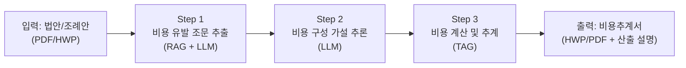
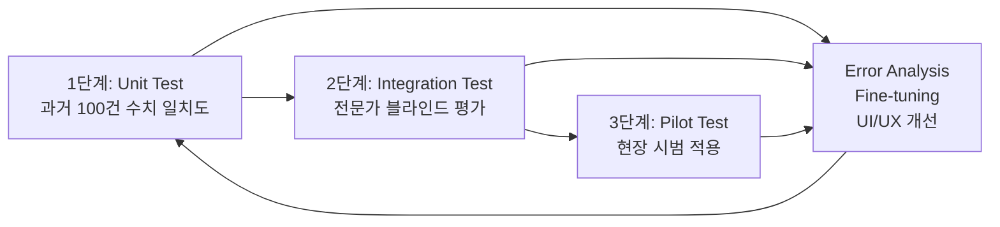

# 비용추계 자동화 시스템 - 기획서 분석 및 구현 계획

## 📋 프로젝트 개요

**과제명**: 테이블 증강생성(TAG) 기술 기반 '비용추계 자동화' 시스템 개발

**한줄 요약**: 법안(PDF/HWP)을 업로드하면 AI가 비용 유발 조항을 분석하고, 관련 통계·단가를 자동으로 찾아 **비용추계서(표+텍스트)**를 자동 생성하는 시스템

---

## 🏗️ 시스템 아키텍처 (이미지 1번)

시스템은 **3개 레이어**로 구성됩니다:

| 레이어 | 구성요소 | 역할 |
|-------|---------|------|
| **1. UI/UX Layer** | 법안 업로드(HWP/PDF), 추계 대시보드(Web Editor), Human-in-the-loop 검증 도구 | 사용자 인터페이스 |
| **2. AI Core Engine** | 전처리 모듈(OCR/Table Parsing) → TAG Main Engine(Retriever + Generator + Calculator) → 후처리 모듈(보고서 포맷팅, 근거 매핑, 할루시네이션 필터) | 핵심 AI 처리 |
| **3. Data Infrastructure** | 법령/조례 DB, 비용추계 선례 DB, 공공통계 API(KOSIS), Vector Store | 데이터 저장/검색 |

> [!IMPORTANT]
> **핵심 설계 원칙**: LLM은 **로직(Python 코드)만 생성**하고, 실제 수치 계산은 **샌드박스 Python Solver**가 수행 → 계산 정확도 99% 보장

---

## ⚙️ 시스템 작동 흐름 (이미지 2번)

### 3단계 파이프라인

| 단계 | 기술 | 세부 작업 |
|-----|------|---------|
| **Step 1** | RAG + LLM | 원문 구조화 → 비용 유발 조문 추출 → 트리거(대상/인원) 추출 → 재정 키워드 식별(Must/May) |
| **Step 2** | LLM | 유사 사례 참조(Few-shot) → 비용 항목 시나리오 생성 → 가설 수립(인건비, 운영비 등) |
| **Step 3** | TAG | Table QA & 연산 → 정형 데이터 쿼리 → 수식 매핑 및 계산 → 근거 포함 산출 내역(XAI) |

---

## 🧪 검증 프로세스 (이미지 3번)

---

## 🎯 정량적 목표

| 지표 | 목표치 | 측정 방법 |
|------|-------|---------|
| 비용항목 식별 정확도 | **90%↑** | F1-Score |
| 산출근거 매핑 정확도 | **85%↑** | Top-3 Hit Rate |
| 비용계산 정확도 | **99%** | 오차 1% 이내 |
| 문서작성 시간 단축 | **90%↑** | 10시간 → 1시간 |

---

## 🔧 구현에 필요한 핵심 기술 모듈

### 1. 데이터 수집 및 전처리
- HWP/PDF 파서 (OCR + Table Parsing)
- 국회 비용추계서 1만 건 수집 파이프라인
- 통계청(KOSIS) API 연동
- 테이블 구조(Header-Value) 보존 임베딩

### 2. AI 코어 엔진
- **Retriever**: Dual-Encoder 기반 테이블 검색기 (Semantic Search)
- **Generator**: LLM + Chain-of-Thought 프롬프팅 (비용 분석 → 항목 식별 → 산출식 수립)
- **Calculator**: Python Sandbox (Symbolic Solver) + 이상 탐지 알고리즘

### 3. 후처리 및 출력
- 보고서 포맷팅 (HWP/PDF 표준 서식)
- Evidence Tracing (근거 역추적 + 하이라이트)
- 할루시네이션 필터

### 4. 웹 인터페이스
- 법안 업로드 UI
- 추계 대시보드 (Web Editor)
- Human-in-the-Loop 검토/수정 도구

---

## 📐 제안하는 기술 스택

| 영역 | 기술 |
|------|------|
| **Backend** | Python (FastAPI) |
| **Frontend** | Next.js (React) |
| **LLM** | OpenAI GPT-4o / Claude API (또는 자체 fine-tuned 모델) |
| **Vector DB** | Pinecone / Weaviate / ChromaDB |
| **RDBMS** | PostgreSQL (비용추계 선례 DB, 정형 데이터) |
| **문서 파싱** | pyhwp, PyMuPDF, Camelot (테이블 추출) |
| **임베딩** | Sentence-Transformers / OpenAI Embeddings |
| **Sandbox** | RestrictedPython / Docker Container |
| **배포** | Docker + AWS/GCP |

---

## User Review Required

> [!IMPORTANT]
> 현재 프로젝트 디렉토리에는 기획서와 이미지만 있고, **코드가 전혀 없는 상태**입니다. 아래 사항에 대해 결정이 필요합니다:

1. **개발 범위**: 전체 시스템을 처음부터 구현할 건지, 아니면 특정 모듈(예: 웹 UI, AI 코어 등)부터 시작할 건지?
2. **기술 스택 확인**: 위에서 제안한 기술 스택이 맞는지, 혹은 이미 선호하는 기술이 있는지?
3. **LLM 선택**: OpenAI API / Claude API / 오픈소스 모델 중 어떤 것을 사용할 건지?
4. **프로토타입 vs 풀스택**: MVP(최소 기능 제품)부터 시작할 건지, 전체 설계를 먼저 완성할 건지?
5. **데이터**: 국회 비용추계서 데이터나 통계청 데이터를 이미 확보했는지?

 결론적으로 진행 과정은 이렇게 잡으면 됩니다.

  1. 지방의회 양식 확정
  가장 먼저 해야 할 일입니다.

  자료:

  - 경기도/서울시 등 지방의회 비용추계 조례
  - 별지 제1호 비용추계서 양식
  - 별지 제2호 비용추계서 미첨부 사유서 양식

  활용:

  - 시스템이 최종으로 출력할 문서 양식
  - 항목 구조 정의
  - “비용추계서 작성 대상인지 / 미첨부 사유서 대상인지” 판단 기준

  즉, 최종 답안지는 지방의회 양식입니다.

  2. 지방의회 실제 비용추계서 수집
  그다음은 지방의회 실제 사례를 모아야 합니다.

  자료:

  - 각 지방의회 의안 상세 페이지
  - 조례안 첨부 비용추계서
  - 비용추계서 미첨부 사유서
  - 검토보고서

  활용:

  - 지방의회 문체 학습
  - 실제 제출 수준의 문서 구조 학습
  - 어떤 조례안에서 비용이 발생하는지 판단
  - 지방재정 단위, 사업 단위, 부서 표현 학습

  즉, 지방의회 자료는 실전 기준 데이터입니다.

  3. 국회 비용추계서 수집
  이미 API로 접근 가능한 국회 자료입니다.

  자료:

  - 열린국회정보 의안 API
  - LIKMS 의안 상세 첨부파일
  - 비용추계서
  - 비용추계서 미첨부 사유서

  활용:

  - 대량 선례 DB
  - 정책 유형별 비용 항목 추출
  - 산식 패턴 학습
  - “이런 정책이면 보통 어떤 비용이 발생하는가” 학습
  - 미첨부 사유 유형 분류

  주의:

  - 국회 자료는 최종 양식 학습용이 아님
  - 지방의회 출력 양식과 다를 수 있음
  - 산식과 판단 근거 참고용으로 써야 함

  즉, 국회 자료는 양 많은 선례 학습 데이터입니다.

  4. NABO 보고서 수집
  국회예산정책처 자료입니다.

  자료:

  - NABO 비용추계 보고서
  - 재정전망 보고서
  - 법안 비용추계 해설 자료

  활용:

  - 고품질 추계 논리 학습
  - 추계 근거 작성 방식 학습
  - 단가, 대상자 수, 연도별 비용 산정 방식 참고
  - 모델 평가용 Gold Standard

  즉, NABO 자료는 고품질 정답 예시입니다.

  5. KOSIS/공공통계 수집
  이건 문서 학습용이 아니라 계산용입니다.

  자료:

  - KOSIS 인구 통계
  - 물가 지수
  - 임금 통계
  - 사업체 수
  - 고용 통계
  - 복지 대상자 수
  - 지역별 통계

  활용:

  - 실제 비용 계산 변수
  - 대상자 수 추정
  - 단가 보정
  - 연도별 증가율 계산
  - 지역별 규모 반영

  즉, KOSIS는 계산 엔진의 숫자 원천입니다.

  6. 지자체 내부/예산 자료 연결
  가능하면 가장 중요합니다.

  자료:

  - 세출예산서
  - 사업설명서
  - 지방재정365
  - 부서별 기존 사업 단가
  - 인건비 기준
  - 보조금 기준
  - 시설 운영비 기준

  활용:

  - 실제 지방비 단가
  - 기존 유사사업 비용
  - 재원조달방안 작성
  - 연도별 비용 현실화

  즉, 실제 제출 가능한 비용은 지자체 예산 자료로 보정해야 합니다.

  전체 구조는 이렇게 보면 됩니다.

  [지방의회 조례/별지 양식]
  → 최종 출력 형식

  [지방의회 실제 비용추계서]
  → 지방의회 스타일, 제출 기준 학습

  [국회 비용추계서]
  → 대량 선례, 정책 유형별 산식 학습

  [NABO 보고서]
  → 고품질 추계 논리 학습

  [KOSIS/공공통계]
  → 계산에 들어가는 수치 데이터

  [지자체 예산/내부 자료]
  → 실제 지역 단가와 재원조달 근거

  따라서 우리가 지금부터 진행해야 하는 순서는:

  1. 출력 양식 확정
  2. 지방의회 비용추계서 샘플 수집
  3. 국회 비용추계서 대량 수집
  4. 비용추계서 / 미첨부 사유서 / 일반 의안문서 분류
  5. NABO 고품질 보고서 수집
  6. KOSIS 계산 변수 DB 구축
  7. 조례안 입력 → 비용 발생 여부 판단
  8. 유사 선례 검색
  9. 산식 생성
  10. KOSIS/예산 데이터로 계산
  11. 지방의회 별지 양식으로 최종 문서 생성

  한 줄로 정리하면:

  지방의회 양식으로 출력하고, 지방의회 자료로 실무 스타일을 맞추고, 국회/NABO 자료로 산식과 선례를 학습하고, KOSIS/예산 자료로 실제
  숫자를 계산하는 구조입니다.